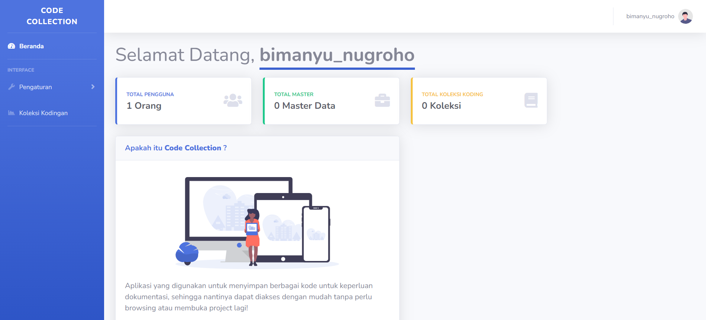

# **CODE COLLECTION**



## Tentang Proyek

Proyek ini namanya **Code Collection Project**, Aplikasi ini membantu kalian untuk mendokumntasikan code kalian.
Kalian tenang saja karena code kalian aman tanpa dihapus atau diedit oleh user lain.

## Memulai

Langkah-langkah dasar untuk memulai menggunakan proyek ini.

## Instalasi

1. Clone repositori:

    ```bash
    git clone git@github.com:bimanyunugroho/code-collection.git
    ```

2. Pindah ke direktori proyek:

    ```bash
    cd code-collection
    ```

3. Install dependensi:

    ```bash
    composer install
    ```

4. Salin file `.env.example` ke `.env` dan atur konfigurasi sesuai kebutuhan.

    ```bash
    cp .env.example .env
    ```

5. Generate kunci aplikasi:

    ```bash
    php artisan key:generate
    ```

6. Buat Database dengan nama **code-colletion** dulu, atau copas aja dibawah ini di file **_.env_**:

    ```bash
    DB_CONNECTION=mysql
    DB_HOST=127.0.0.1
    DB_PORT=3306
    DB_DATABASE=code-collection
    DB_USERNAME=root
    DB_PASSWORD=
    ```

7. Jalankan migrasi:

    ```bash
   php artisan migrate
    ```

8. Lalu jalankan aplikasinya **_(XAMPP)_**:

    ```bash
   php artisan serve
    ```
   
9. Kalau kalian pakai **_Laragon_** bisa lakukan :
   
    ```bash
   code-collection.test
    ```
